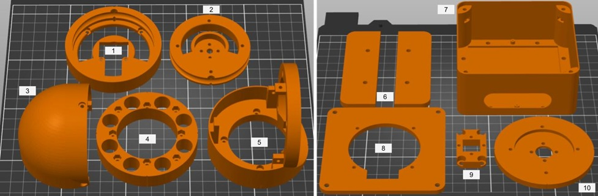
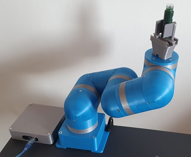
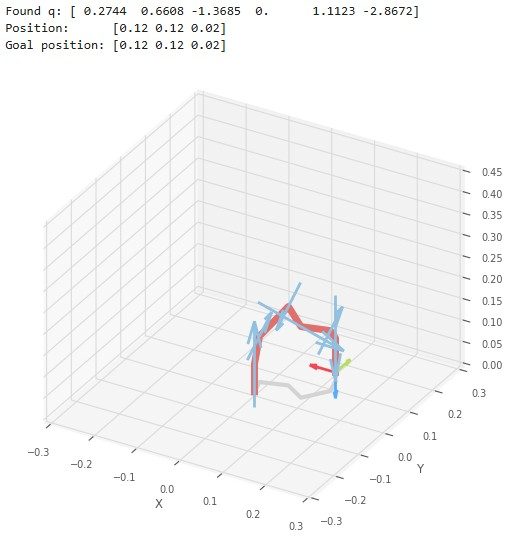
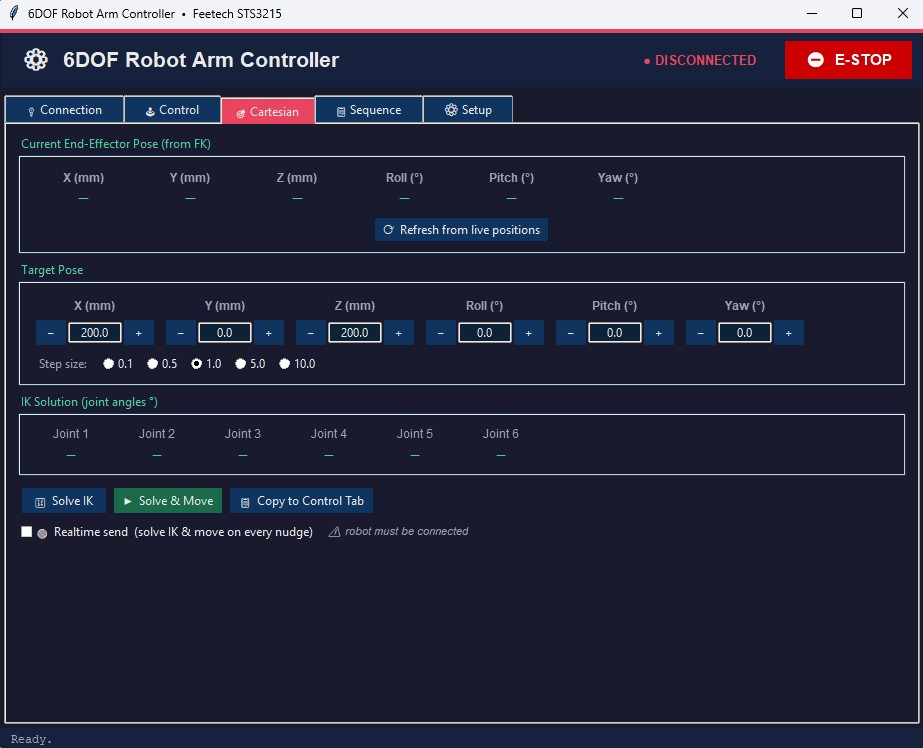

# MECHO: Modular Extensible Cobot for Human-Centered Operations

This repository contains files for the development of modular robotic arm platform.

The platform is based on the well-known Feetech STS3215-12V smart servo motors: [https://www.dfrobot.com/product-2962.html](https://www.dfrobot.com/product-2962.html).

It was also tested with Herkulex DRS-0101, but they have requirement for 7.5V power supply and encoder with a lower resolution. Also, the Dynamixel AX-12A was considered, but the dimensions were not suitable for the application.

Different constructions can be built by using the following parts:

1. Actuator motor housing;
2. Actuator output ring;
3. 90-degree bracket cover;
4. 15 mm spacer;
5. 90-degree bracket;
6. Base clamp mount bracket;
7. Base box;
8. Base cover;
9. Gripper mounting bracket;
10. Tool mounting bracket.

The parts are shown in the following image:

[](./images/parts.jpg)

For the robotic gripper the Micro Servo Parallel Gripper by Techniccontroller is used: [https://grabcad.com/library/micro-servo-parallel-gripper-1](https://grabcad.com/library/micro-servo-parallel-gripper-1).

Currently, the control box of the robot. For the control of the robot an [Arduino Mega 2560 board](https://store.arduino.cc/products/arduino-mega-2560-rev3) is used. for the communication with the servo motors a dedicated [Serial Bus Servo Driver Board](https://www.dfrobot.com/product-3002.html) is connected to a UART port of the Arduino. An additional [25W DC-DC Power Module](https://www.dfrobot.com/product-752.html) is added to the control box for providing stable 5V output for the end effector and if needed also for the Arduino.

The robot assembled in a 6 degree of freedom configuration and the control box are shown in the following image.

[](./images/robot.jpg)

## Experiments and Videos

Executions of the Task Board v2023 tasks: button press and circuit probing tasks of the Task Board v2023: [https://github.com/peterso/robotlearningblock](https://github.com/peterso/robotlearningblock) are shown in the following video: [https://youtu.be/xAtnlniCpGE](https://youtu.be/Kb3CY3zpSdE).

Demonstration of the execution of a task to pick up a bottle lying in a horizontal position and place it in another place, but this time in a vertical position is shown in the following video: [https://youtu.be/xAtnlniCpGE](https://youtu.be/xAtnlniCpGE).

[](https://youtu.be/xAtnlniCpGE)

## CAD and STL files

In the folder [CAD](./CAD/) you can find the source CAD files. They were delevoped by using the FreeCAD software: [https://www.freecad.org/](https://www.freecad.org/).

Differenr robot configurations with 4, 5 or 6 degrees of freedom in a CAD environment can be found in the folder [CAD/Assemblies](./CAD/Assemblies/).

In the folder [STLs](./STLs/) you can find the exported STL files which can be 3D printed.

## Kinematics

In the folder [Kinematics](./Kinematics/) you will find a useful example Jupyter notebooks which shows how the forward and inverse kinematics can be solved by using Robotics Toolbox for Python.



## Software

The folder [Software](./Software/) contains useful Python packages and application for the control of the robot when STS3215 servo motors are used. 

You can run the control software with the following commands:

```bash
cd Software
python app.py
```



It is still under active development.

There are also `robot_api` and `robot_arm` python packages which can be installed locally and used for coding python programs for the control of the robot. The packages can be installed locally in editable mode with: `pip install -e .`. An example program can be found in [./Software/test_api.py](./Software/test_api.py). This API is similar to the Python API for the commercial xArm cobots: [https://github.com/xArm-Developer/xArm-Python-SDK](https://github.com/xArm-Developer/xArm-Python-SDK).

You can also find the firmware for the Arduino board in the folder [./Software/arduino_controller/](./Software/arduino_controller/). This firware allows you to use a regular PWM (micro) servo for the gripper. The firmware will assign to it a virtual ID 7 and be able to control it with the same library and commands as those for the other smart STS3215-12V servos. The library for the servos is described in [https://github.com/vassar-robotics/feetech-servo-sdk](https://github.com/vassar-robotics/feetech-servo-sdk).

## License

Everything is this repository is licensed under the standard MIT license.